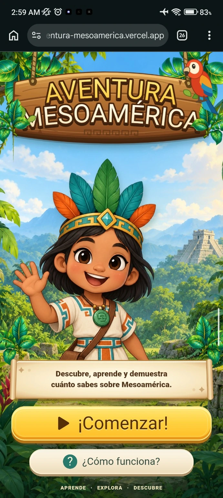
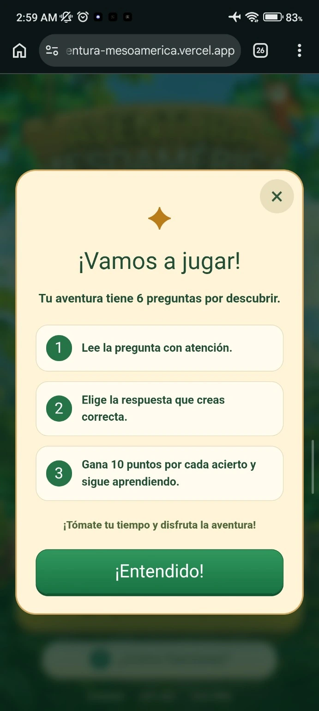
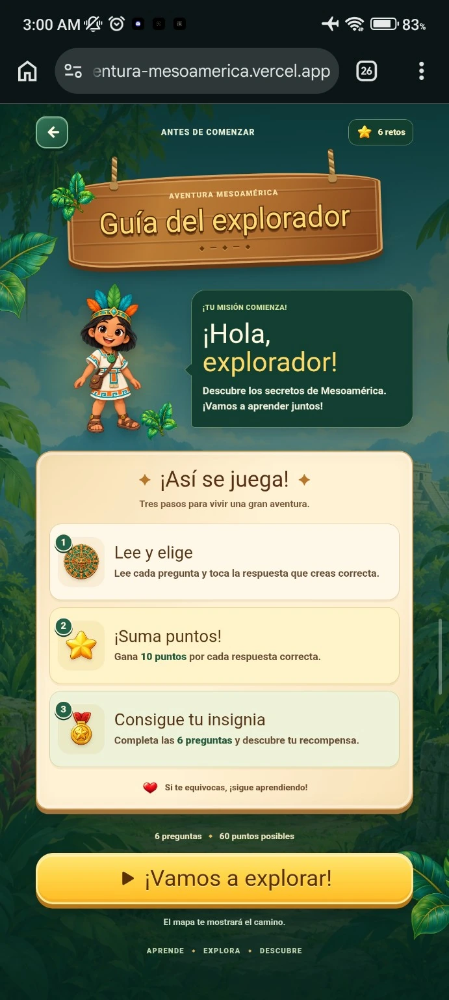
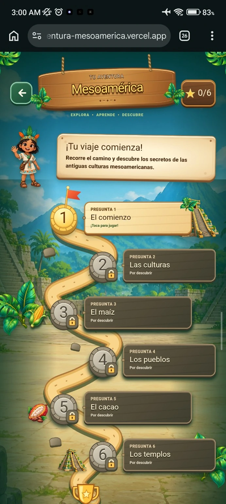
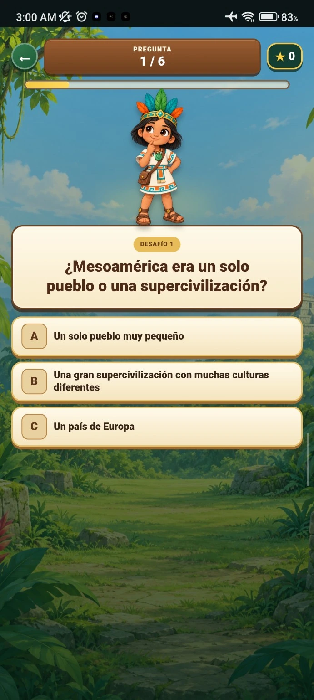
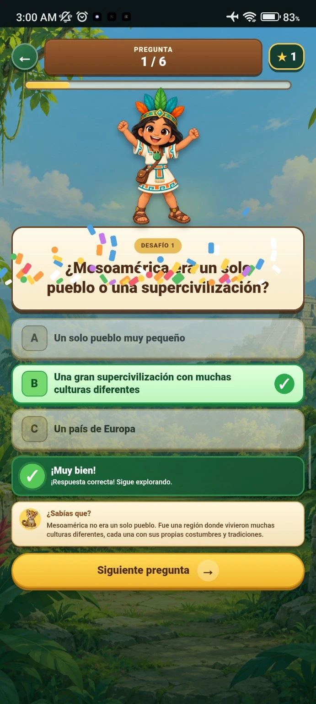
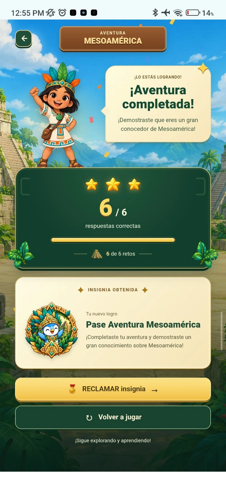
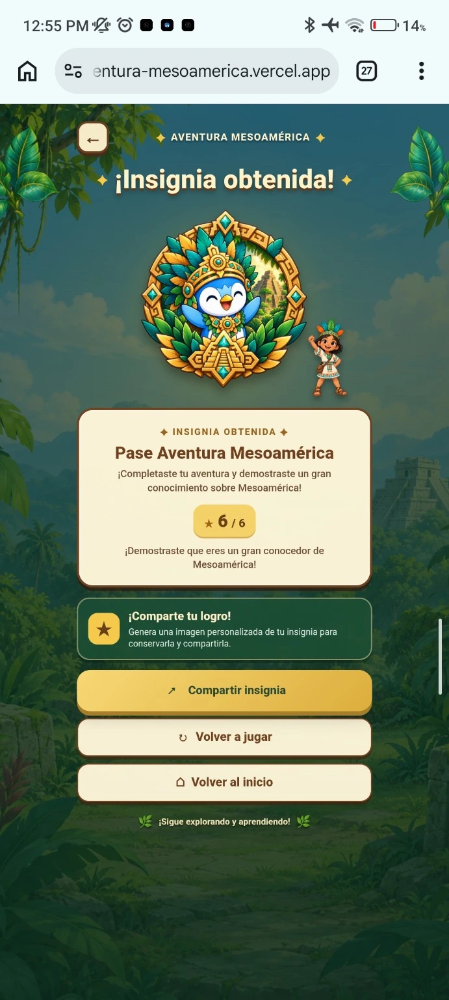
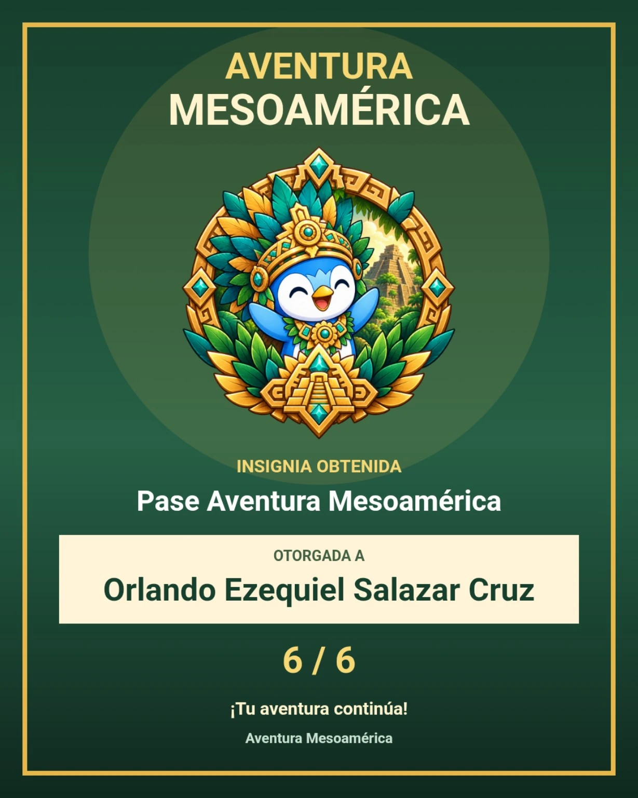

# 🌿 Aventura Mesoamérica

> Una experiencia web educativa e interactiva para que niñas y niños puedan descubrir algunos aspectos de Mesoamérica mientras ponen a prueba sus conocimientos.


## 🎮 Sobre el proyecto

**Aventura Mesoamérica** es un proyecto desarrollado principalmente como práctica de desarrollo frontend con **Angular 22**, pero con la intención de aportar un pequeño granito de arena mediante una experiencia educativa y entretenida.

La aplicación utiliza una temática de exploración para presentar un recorrido compuesto por retos y preguntas sobre Mesoamérica. El usuario puede avanzar por un mapa, responder preguntas, obtener puntos y finalmente conseguir una insignia como recompensa.

### ✨ Características

- 🗺️ Mapa de aventura con retos progresivos.
- ❓ Quiz de 6 preguntas sobre Mesoamérica.
- ⭐ Sistema de puntos y progreso.
- 🏅 Insignia al completar la aventura.
- 🎉 Retroalimentación visual para respuestas correctas e incorrectas.
- 📚 Pequeñas explicaciones después de responder.
- 📱 Diseño responsive y orientado principalmente a dispositivos móviles.
- 🎨 Interfaz con temática de exploración, naturaleza y culturas mesoamericanas.
- 🖼️ Generación de una insignia personalizada para conservar y compartir el logro.

## 🛠️ Tecnologías

- **Angular 22**
- **TypeScript**
- **SCSS**
- **Tailwind CSS**
- **Vercel**

## 📸 Vista previa

### 🏠 Inicio



### 📖 Guía del explorador



### 🗺️ Mapa de aventura



### ❓ Pregunta



### ✅ Respuesta correcta



### ❌ Respuesta incorrecta



### 🏆 Resultado



### 🏅 Insignia obtenida



### 🎖️ Insignia personalizada



## 🚀 Desarrollo local

### Requisitos

Necesitas tener instalado:

- Node.js
- pnpm
- Angular CLI

### Instalar dependencias

```bash
pnpm install
```

### Servidor de desarrollo

Para iniciar el servidor local:

```bash
pnpm ng serve
```

Después abre:

```text
http://localhost:4200/
```

La aplicación se recargará automáticamente cuando modifiques los archivos fuente.

## 🏗️ Compilar el proyecto

Para generar una compilación de producción:

```bash
pnpm build
```

Los archivos generados se almacenarán en el directorio `dist/`.

## 🧪 Pruebas

Para ejecutar las pruebas unitarias:

```bash
pnpm ng test
```

Si el proyecto cuenta con configuración para pruebas end-to-end, puedes ejecutarlas con:

```bash
pnpm ng e2e
```

Angular CLI no incluye un framework e2e por defecto, por lo que este comando depende de la configuración del proyecto.

## 📁 Estructura general

```text
src/
├── app/
│   ├── core/
│   ├── data/
│   ├── features/
│   │   └── quiz/
│   │       ├── components/
│   │       └── pages/
│   ├── layout/
│   └── shared/
└── assets/

public/
└── assets/
    └── readme/
```

## 🎯 Objetivo del proyecto

Este proyecto nació como una forma de **practicar Angular y desarrollo frontend**, experimentando especialmente con:

- Diseño de interfaces educativas.
- Gamificación.
- Componentización.
- Manejo del estado y progreso del quiz.
- Diseño responsive.
- Experiencias interactivas para dispositivos móviles.

Al mismo tiempo, busca demostrar que un proyecto de práctica puede convertirse en una pequeña experiencia con propósito: **aprender, explorar y descubrir**.

## 🌐 Demo

La aplicación está disponible en:

**https://aventura-mesoamerica.vercel.app/**

## 📚 Recursos de Angular

Este proyecto fue generado con [Angular CLI](https://angular.dev/tools/cli) versión **22.1.8**.

Para consultar la documentación oficial:

- [Angular](https://angular.dev/)
- [Angular CLI](https://angular.dev/tools/cli)
- [TypeScript](https://www.typescriptlang.org/)
- [Tailwind CSS](https://tailwindcss.com/)

---

🌿 **Aprende · Explora · Descubre**

Hecho con Angular y muchas ganas de seguir aprendiendo.
